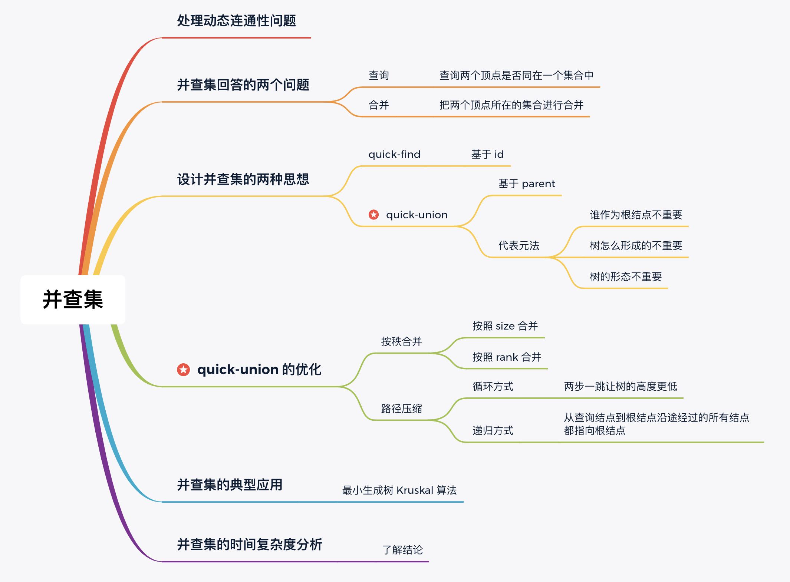

# 并查集 (Union find)
在计算机科学中，并查集（Union find / Disjoint-set data structure，直译为不交集数据结构）是一种数据结构，用于处理一些不交集（Disjoint sets，一系列没有重复元素的集合）的合并及查询问题。并查集支持如下操作：

- **查询：** 查询某个元素属于哪个集合，通常是返回集合内的一个“代表元素”。这个操作是为了判断两个元素是否在同一个集合之中。
- **合并：** 将两个集合合并为一个。
- **添加：** 添加一个新集合，其中有一个新元素。添加操作不如查询和合并操作重要，常常被忽略。
由于支持查询和合并这两种操作，并查集在英文中也被称为联合-查找数据结构（Union-find data structure）或者合并-查找集合（Merge-find set）。

**并查集** 可以用来指代任何支持上述操作的数据结构，但是一般来说，**并查集** 特指其中最常见的一种实现：**不交集森林（Disjoint-set forest）** 。
并查集是用于计算最小生成树的克鲁斯克尔算法中的关键。由于最小生成树在网络路由等场景下十分重要，并查集也得到了广泛的引用。此外，并查集在符号计算，寄存器分配等方面也有应用。

---

## 思维导图

---

## 1.并查集动态处理的两个问题
### 查询（Find）
查询图中的两个顶点是不是在同一个集合中。
> 注意：并查集只回答两个顶点之间是否有一条路径连接，而不回答怎么连接。
### 合并（Union）
将两个不相交集合进行合并。

## 2.设计并查集的两种思想
### 2.1. Quick-Find：基于 id

**基于id** 的思想很常见：

- 古代打仗的时候，士兵用不同颜色的军服区分敌我；
- 导游给同一个旅游团的成员发放同样颜色的帽子，以便认识同一个旅游团的成员；
- 身着情侣装走在大街小巷，其实也起到了标识的作用。

**基于id** 的思想给每一个元素（顶点）分配一个唯一标识，称为 `id`。

- 初始化时所有元素的 `id` 都不一样，表示一个元素单独属于一个集合。
- 如果两个元素的 `id` 一样，标识它们同属于一个集合；
- 合并的时候，需要将其中一个集合中的 所有元素 的 `id` 赋值成为另一个集合的 `id`（一个集合中的所有元素的 `id` 均一样）。

类似于：给每个元素（顶点）改名字，名字一样，就表示在同一个集合中。

- **优点：** 查询两个元素是否在一个集合中很快，时间复杂度为 `O(1)`
- **缺点：** 把两个集合合并成一个集合较慢，需要遍历其中一个集合中的所有元素。

### 2.2. Quick-Union：基于 parent ⭐️
**基于parent** 的思想：记录每个顶点的父亲顶点是谁。这样设计**并查集**的思想也叫**代表元**法。
我们不再使用 `id` 数组，而使用 parent 数组。`parent` 数组的定义是：`parent[i]` 表示标识为 `i` 的结点的父亲结点的标识（可以形象地记为"找爸爸"）。在这个定义下，根结点的父亲结点是自己。
因此，这种方式形成的**并查集**组织成了 若干个不相交的树形结构，并且我们在访问结点的时候，总是按照**从下到上**进行访问的。

