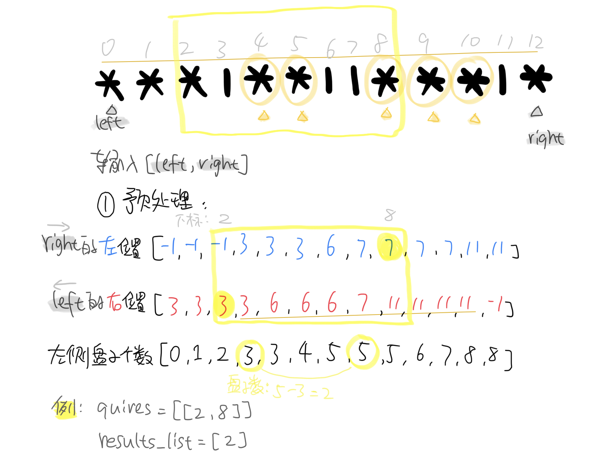

# 2055. 蜡烛之间的盘子
给你一个长桌子，桌子上盘子和蜡烛排成一列。给你一个下标从 `0` 开始的字符串 `s` ，它只包含字符 `'*'` 和 `'|'` ，其中 `'*'` 表示一个 盘子 ，`'|'` 表示一支 蜡烛 。

同时给你一个下标从 `0` 开始的二维整数数组 `queries` ，其中 `queries[i] = [lefti, righti]` 表示 子字符串 `s[lefti...righti`] （包含左右端点的字符）。对于每个查询，你需要找到 子字符串中 在 两支蜡烛之间 的盘子的 数目 。如果一个盘子在 子字符串中 左边和右边 都 至少有一支蜡烛，那么这个盘子满足在 两支蜡烛之间 。

比方说，`s = "||**||**|*"` ，查询 `[3, 8]` ，表示的是子字符串 `"*||**|" `。子字符串中在两支蜡烛之间的盘子数目为 2 ，子字符串中右边两个盘子在它们左边和右边 都 至少有一支蜡烛。
请你返回一个整数数组 `answer` ，其中 `answer[i]` 是第 `i` 个查询的答案。

 

示例 1:

```python

输入：s = "**|**|***|", queries = [[2,5],[5,9]]
输出：[2,3]
解释：
- queries[0] 有两个盘子在蜡烛之间。
- queries[1] 有三个盘子在蜡烛之间。
```

示例 2:

```python
输入：s = "***|**|*****|**||**|*", queries = [[1,17],[4,5],[14,17],[5,11],[15,16]]
输出：[9,0,0,0,0]
解释：
- queries[0] 有 9 个盘子在蜡烛之间。
- 另一个查询没有盘子在蜡烛之间。
```

提示：

```python
3 <= s.length <= 105
s 只包含字符 '*' 和 '|' 。
1 <= queries.length <= 105
queries[i].length == 2
0 <= lefti <= righti < s.length
```
## 题解
### 我的题解
**思路：**
前缀和思想，先遍历完`s`，构造3个预处理数组，再根据`requires`指令来查表得到结果。

- `platecnt[i]`数组无差别存储从`0`累加`i`的盘子数(前缀和)
- `candl`和`candr`数组作为查表函数，输出符合要求的范围

其中，`candl`和`candr`数组通过建立某种映射关系，来解决如何将给定的范围`left`和`right`转化为有效盘子数量的计数范围，最后只要拿着转换后的范围去`platecnt`数组取差分即可：
```
    result = platecnt[candl[right]] - platecnt[candr[left]]
```

需要注意的是边界值，即数组`candl`和`candr`的初始值，`candl`的首个和`candr`最后一个是无信息的，所以分别用`0`和`-1`来作为边界值，这样在`platecnt`数组中读取的时候就是第一个以及最后一个。

```python
class Solution:
    def platesBetweenCandles(self, s: str, queries: List[List[int]]) -> List[int]:
        # 预处理部分
        # 构造前缀和数组
        n = len(s)
        candl = [0]*n
        candr = [-1]*n
        platecnt = [0]*n
        result_list=[]
        for i in range(1, n):
            # 输入参数right从0至n-1开始遍历时，所在位置左侧最近的蜡烛'|'的下标(包括本身)，没有则为0
            candl[i] = i if s[i]=='|' else candl[i-1]
            # 输入参数left从n-1至0开始遍历时，所在位置右侧最近的蜡烛'|'的下标(包括本身)，没有则为-1
            candr[n-i-1] = n-i-1 if s[n-i-1]=='|' else candr[n-i]
            # 所在位置左侧所有盘子个数
            platecnt[i] = platecnt[i-1] + 1 if s[i-1]=='*' else platecnt[i-1]

        for edge in queries:
            result = platecnt[candl[edge[1]]] - platecnt[candr[edge[0]]]
            result_list.append(result if result>=0 else 0)
            # print(f'left[{edge[0]}]: {candr[edge[0]]}\nright[{edge[1]}]: {candl[edge[1]]}\nplate num: {platecnt[candl[edge[1]]] - platecnt[candr[edge[0]]]}\n\n')

        # print(f'{s}\n\nRight: {candl}\nLeft: {candr}\nPlate number: {platecnt}')
        return result_list

```

**图解示例：**

测试：
```python
输入：s = "***|**||***|*", queries = [[2,8]]
输出：[2]
```
Debug信息：
```python
left[2]: 3
right[8]: 7
plate num: 2

***|**||***|*

Right: [0, 0, 0, 3, 3, 3, 6, 7, 7, 7, 7, 11, 11]
Left: [3, 3, 3, 3, 6, 6, 6, 7, 11, 11, 11, 11, -1]
Plate number: [0, 1, 2, 3, 3, 4, 5, 5, 5, 6, 7, 8, 8]

```
图解：

